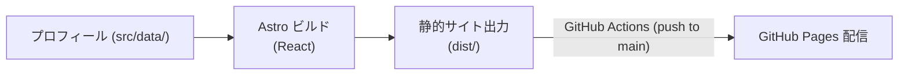

# Dev Log

個人開発の制作物や開発経験を紹介するポートフォリオサイトです。
Astro と React を組み合わせて構築し、GitHub Actions 経由で GitHub Pages に静的ホスティングしています。

- **公開サイト**: [https://shin4488.github.io/dev-log/](https://shin4488.github.io/dev-log/)

---

## サイトの構成と公開フロー



---

## 主な技術スタック

- **フレームワーク**: Astro, React
- **スタイリング**: Vanilla CSS, Bootstrap
- **テスト・品質管理**: Vitest, Playwright, Prettier, TypeScript
- **パッケージマネージャ**: Yarn (v4)

---

## 開発環境のセットアップ

```bash
# Corepack を有効化して依存関係をインストール
corepack enable
yarn install --immutable

# 開発サーバの起動（http://localhost:8000/dev-log/）
yarn dev

# プロダクションビルド
yarn build

# ビルド成果物のローカル確認（http://localhost:9000/dev-log/）
yarn serve
```

### テストと検証

```bash
yarn typecheck    # TypeScript の型検査
yarn lint         # ESLint による静的解析
yarn test         # Vitest によるコンポーネントテスト
yarn test:e2e     # Playwright によるブラウザ回帰テスト
```

---

## 多言語対応

初回にトップURLを開くと、ブラウザの言語設定に応じて日本語・英語を選びます。
画面右上の「日本語 / English」で切り替えると、選択をブラウザに保存します。
各言語のページは静的に生成されるため、直接アクセスや再読み込みにも対応しています。

| ページ | 日本語                               | 英語               |
| ------ | ------------------------------------ | ------------------ |
| トップ | `/dev-log/`                          | `/dev-log/en/`     |
| 404    | `/dev-log/404/`、`/dev-log/404.html` | `/dev-log/en/404/` |

通常の画面はトップページのみです。重複していた `/dev-log/about/` と
`/dev-log/en/about/` は削除し、アクセスすると404を返します。

トップURLでは保存済みの選択を優先し、未選択ならブラウザの言語設定を順に確認します。
対応する言語がなければ日本語を表示します。英語版の `/dev-log/en/` を直接開くと、
保存済みの選択にかかわらず英語を表示します。切り替えると同じページの別言語版に移動し、
URLにセクションの指定（`#projects` など）がある場合はその指定も引き継ぎます。
GitHub Pagesが存在しないURLに返す404ページは日本語です。
ブラウザの保存領域が使えない場合は、切り替えた言語を `?lang=ja` / `?lang=en` で指定します。
JavaScriptを無効にした場合も、日英のページ表示とリンクでの言語切り替えを利用できます。

共通の表示文言とURLの処理は `src/lib/i18n.ts`、作品の翻訳は
`src/data/selfDevelopment.ts`、技術名と注釈の翻訳は `src/data/skillLevel.ts` にあります。

## ディレクトリ構成

```text
dev-log/
├── src/
│   ├── pages/            # Astro のルーティング・静的ページ生成
│   ├── views/            # トップページや自己紹介などの React 画面
│   ├── components/       # 共有 UI コンポーネント
│   ├── layouts/          # ページレイアウト・共通ヘッダー/フッター
│   └── data/             # スキル一覧や作品リンクなどのプロフィールデータ
└── static/               # ファビコンなどの静的アセット
```
